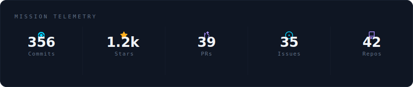

  

 

  

 

  

 

  

 

<strong>More about me</strong>

 

I build practical tools for everyday engineering productivity.
Focused on developer experience, workflow automation, and AI-assisted coding.

**Currently at** Ant Financial — Hangzhou, China

 

  
  

